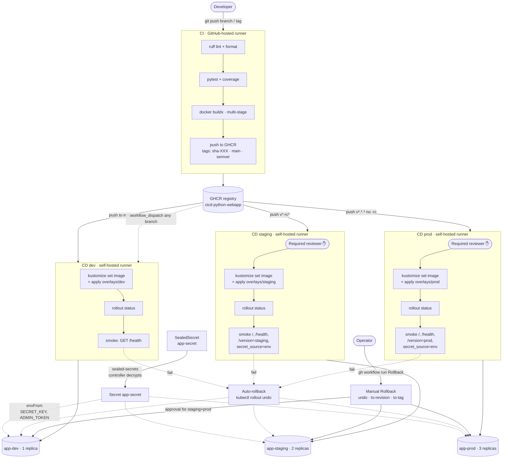

# cicd-python-webapp

A minimal Python web application used as the deployment target for an end-to-end
CI/CD pipeline running on GitHub Actions and microk8s.

This repository is the deliverable for a CI/CD design exercise. The
**Architecture overview** below answers the four design questions in the task
brief — pipeline steps, environment strategy, rollback mechanism, secret
management — and includes the requested flow diagram.

## Architecture overview



### 1. Pipeline — commit to production

`CI` ([.github/workflows/ci.yml](.github/workflows/ci.yml)) runs on every
push and every PR: lint with ruff, test with pytest + coverage, then (push
events only, never PRs) build a multi-stage Docker image and push to GHCR.
Tags assigned by `docker/metadata-action`: `sha-<short>` for every commit
(immutable), `main` floating on the default branch, `<semver>` for `v*`
tag pushes. `CI` outcome gates the three `CD` workflows via `workflow_run`.

Going from a green CI to a running pod is a single workflow per environment,
each a thin shell around the same four steps: pin the image tag in the
overlay (`kustomize edit set image`), `kubectl apply -k`, wait for
`kubectl rollout status`, run an in-pod smoke test via `kubectl exec`.
The smoke test hits `127.0.0.1` inside the pod — it isolates "did the
rollout produce a healthy pod" from "is the ingress path working", and
catches a class of failures (image pinned correctly, container starts,
healthcheck returns OK, runtime secret wired) before any user traffic.

The CD trigger filters live at the `workflow_run.branches` level, not in
job-level `if:` conditions — so a CI run from a feature branch never even
creates a skipped cd-dev/cd-staging/cd-prod run in the Actions UI. The
`sha-<short>` tag is always immutable; combined with `kustomize edit`
pinning, every deployment is reproducible to a single commit. Feature
branches build images too but only get deployed via `workflow_dispatch` —
the automatic path is exclusive to `main` / `v*-rc*` / `v*.*.*`.

### 2. Environment strategy

Three Kubernetes namespaces backed by three Kustomize overlays sharing one
`base/`:

| Env | Namespace | Replicas | Trigger | Gate |
|---|---|---|---|---|
| **dev** | `app-dev` | 1 | push to `main` (auto) | none — fast iteration |
| **staging** | `app-staging` | 2 | push `v*-rc*` tag | Required reviewer on `staging` GH Environment |
| **prod** | `app-prod` | 3 | push `v*.*.*` tag (no `-rc`) | Required reviewer on `production` GH Environment |

`dev` is intentionally the "does it run" sandbox — any feature branch can be
sideloaded into it via `workflow_dispatch`. `staging` is the rehearsal
target gated by manual approval and a stricter smoke check (asserts
`/version=staging` AND `secret_source=env` — catches both wrong-overlay
and missing-secret misconfigurations). `prod` mirrors staging's shape but
binds to the `production` GH Environment, typically with a different
reviewer pool. The same commit can flow `main → dev → v0.1.0-rc1 →
staging → v0.1.0 → prod`, building four GHCR tags along the way (one
`sha-`, one each for the RC and final semvers).

Replica counts grow per environment because risk profile grows: dev needs
1 to validate "does it boot", staging needs ≥2 to validate rolling-update
behavior (zero-downtime requires `maxSurge: 1, maxUnavailable: 0` from
the base deployment to actually work), prod gets 3 for redundancy.
Promotion is **tag-driven**, not branch-driven: `main` is always the dev
target; staging and prod consume immutable semver tags. This means
"what's in prod" is always a named release, not a sliding HEAD.

### 3. Rollback mechanism

Two layers, each tuned to a different failure mode:

- **Automatic, in-pipeline:** each `CD (*)` workflow runs `kubectl rollout
  undo` if its own `rollout status` or smoke step fails
  ([example](.github/workflows/cd-prod.yml)). Catches "the new revision
  crashes on boot or fails health checks within the first few minutes" —
  i.e. failures that happen during the deploy window. No human in the
  loop: the deploy that started the rollout also reverses it.

- **Manual, break-glass:** [.github/workflows/rollback.yml](.github/workflows/rollback.yml),
  triggered from the GitHub Actions UI or via `gh workflow run`. Three
  modes:
  - `undo` — `kubectl rollout undo` to the immediately previous revision.
  - `to-revision N` — `--to-revision=N`, jump to a specific number from
    `kubectl rollout history`. Useful when the last two deploys were both
    bad.
  - `to-tag X` — `kustomize edit set image` + apply. Replays a known-good
    immutable image tag through the overlay, **works even when the
    in-cluster revision history was trimmed past the version you want**.

  Binds to the same GH Environment as the forward deploy, so a prod
  rollback waits for the same Required reviewer that gates `CD (prod)`.
  Shares the `cd-<env>` concurrency group with the forward deploy → a
  rollback can never race against an in-flight deploy on the same
  namespace.

Database migrations are explicitly out of scope (no DB in this app). In a
real system, the `Rollback` workflow remains useful for app code, but a
schema rewind requires **backward-compatible migration patterns** (expand
→ migrate → contract, or "additive only") so that the prior app version
can still run against the new schema. That's a property of the migration
tooling, not the rollback workflow.

### 4. Secret management

Two layers, each tool fitting its real scope:

- **GitHub Secrets** for things the *workflow* needs (e.g. `GITHUB_TOKEN`
  for GHCR push; would also hold `SLACK_WEBHOOK_URL` if deploy
  notifications were wired). Scoped to the repo or Environment, injected
  into runs as `${{ secrets.X }}`, never reach the cluster.

- **Bitnami Sealed Secrets** for things the *running pod* needs
  (`SECRET_KEY` for Flask sessions, `ADMIN_TOKEN` for the gated `/admin`
  endpoint). `kubeseal` encrypts plaintext against the cluster's public
  key; the encrypted manifest is safe to commit
  ([k8s/base/sealedsecret.yaml](k8s/base/sealedsecret.yaml)); only the
  in-cluster controller can decrypt it; resulting `Secret app-secret` is
  mounted via `envFrom: secretRef` so the pod sees env vars but no file.
  `/version` reports a fingerprint + source of the live `SECRET_KEY` as
  proof-of-wiring, and the staging/prod smoke tests fail closed if
  `secret_source != env` — catching the subtle "Secret exists but with
  wrong keys" misconfiguration that `envFrom` alone wouldn't catch.

The dual approach reflects threat-model separation: GitHub Secrets are
managed by repo admins through the GitHub UI (no audit log granularity
beyond "who set it"); Sealed Secrets are managed in-repo with the
`kubeseal` CLI, leaving a full git audit trail and allowing anyone with
commit access to safely rotate without touching the GitHub UI. Each
SealedSecret is also **cluster-bound** — the encrypted file is useless to
anyone (including the developer who created it) outside the cluster whose
keypair sealed it.

## Application surface

| Path | Purpose |
| ---- | ------- |
| `GET /` | App identity (`{"message": "cicd-python-webapp"}`) |
| `GET /health` | Liveness/readiness probe target (`{"status": "ok"}`) |
| `GET /version` | Reports `APP_VERSION` (from ConfigMap) + `secret_fingerprint` + `secret_source` (proof that the Sealed Secret pipeline wired `SECRET_KEY` into the pod) |
| `GET /admin` | Bearer-token-gated demo endpoint; reads `ADMIN_TOKEN` from the Sealed Secret. Comparison uses `hmac.compare_digest` to avoid timing side-channels. Returns 503 if `ADMIN_TOKEN` not configured, 401 on missing/wrong token. |

Flask app on gunicorn (2 workers) inside a multi-stage container; runs as
non-root UID `10001`, `readOnlyRootFilesystem: true` paired with an
`emptyDir` at `/tmp` for gunicorn's worker heartbeat files. 10 tests, 98%
coverage.

## Repository layout

```
.
├── .github/workflows/
│   ├── ci.yml                      # lint + test + build-push to GHCR
│   ├── cd-dev.yml                  # main → app-dev + smoke + auto-rollback
│   ├── cd-staging.yml              # v*-rc* → app-staging w/ approval gate
│   ├── cd-prod.yml                 # v*.*.* (no -rc) → app-prod w/ approval gate
│   └── rollback.yml                # manual break-glass: undo / to-revision / to-tag
├── app/
│   └── main.py                     # Flask: /, /health, /version, /admin
├── tests/
│   └── test_app.py                 # pytest + coverage
├── k8s/
│   ├── base/                       # Deployment (envFrom secretRef), Service, Ingress, SealedSecret, kustomization
│   └── overlays/
│       ├── dev/                    # app-dev,     replicas 1, dev.app.local
│       ├── staging/                # app-staging, replicas 2, staging.app.local
│       └── prod/                   # app-prod,    replicas 3, prod.app.local
├── Dockerfile                      # multi-stage, non-root UID 10001, gunicorn
├── requirements.txt                # flask, gunicorn
├── requirements-dev.txt            # + pytest, pytest-cov, ruff
└── README.md                       # this file — design deliverable
```

## Run locally

```bash
python -m venv .venv && source .venv/bin/activate
pip install -r requirements-dev.txt

pytest                                    # 10 tests, 98% coverage
APP_VERSION=local python -m app.main      # http://localhost:8000
```
